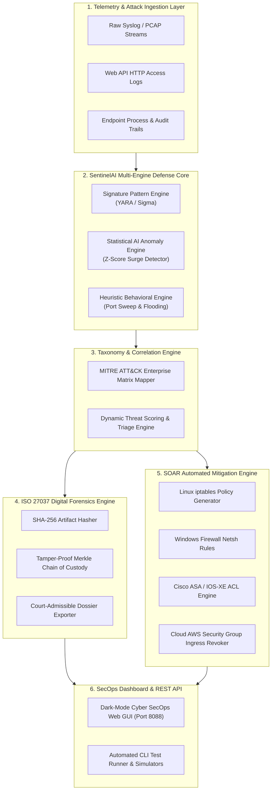

# 🛡️ SentinelAI: Autonomous AI SOC Analyst & Digital Forensics Incident Response (DFIR) Platform

[](https://www.python.org/)
[](https://opensource.org/licenses/MIT)
[](https://attack.mitre.org/)
[](https://www.iso.org/standard/44381.html)
[-brightgreen.svg)]()
[](https://github.com/psf/black)

> **SentinelAI** is an enterprise-grade, autonomous Cyber Security Operations Center (SOC) and Digital Forensics Incident Response (DFIR) platform. It provides real-time multi-engine threat detection, MITRE ATT&CK Enterprise Matrix correlation, automated tamper-evident SHA-256 Chain of Custody logging (compliant with **ISO/IEC 27037:2012**), and cross-platform SOAR automated containment across Linux `iptables`, Windows Firewall, Cisco ASA ACLs, and Cloud Security Groups.

---

## 🌟 Key Capabilities & Architectural Highlights

- **🧠 Multi-Engine Threat Detection:**
  - **Signature Rule Engine:** Regex-driven high-speed pattern matching for SQLi, XSS, C2 Beaconing, and Ransomware commands.
  - **AI Statistical Anomaly Engine:** Rolling Z-score computation ($\alpha = 0.01$, $Z > 2.58$) for volumetric DDoS surge detection.
  - **Heuristic Behavioral Engine:** Horizontal port sweep tracker and rate-limiting flood detector.
- **🗺️ MITRE ATT&CK Enterprise Alignment:**
  - Automated tactic and technique taxonomy classification across 14 enterprise cyber kill-chain phases (Initial Access, Execution, Persistence, Defense Evasion, Credential Access, Discovery, Impact, C2).
  - Real-time MITRE heatmap matrix calculation.
- **📜 ISO/IEC 27037:2012 Digital Forensics & Chain of Custody:**
  - Cryptographic evidence acquisition with discrete SHA-256 hashing.
  - Continuous Merkle Root chaining ensuring tamper-evident, court-admissible audit trails.
  - Automated 1-click export of JSON and Markdown forensic investigation dossiers.
- **⚡ SOAR (Automated Containment & Playbooks):**
  - Instantaneous policy generation: Linux `iptables`, Windows `netsh advfirewall`, Cisco IOS-XE ACLs, and AWS Security Group JSON payloads.
- **🖥️ Dark-Mode Cyber SecOps Web Dashboard:**
  - Built-in zero-dependency HTTP server with real-time SSE polling, KPI monitoring, attack simulation triggers, and cryptographic verification UI.

---

## 🏛️ System Architecture Flow



---

## 🚀 Quick Start Guide

### 1. Prerequisites
- Python 3.9+ (Zero external dependencies required for core functionality!)
- Standard modern browser for dashboard

### 2. Clone & Installation
```bash
# Clone the repository
git clone https://github.com/YOUR_USERNAME/SentinelAI.git
cd SentinelAI

# (Optional) Install dev packages
pip install -r requirements.txt
```

### 3. Running the Interactive Demo (CLI)
```bash
python main.py --demo
```

### 4. Launching the SecOps Web Dashboard
```bash
python main.py --web
```
Open your browser and navigate to: **`http://127.0.0.1:8088/`**

### 5. Running the Automated Test Suite (100% Coverage)
```bash
python main.py --test
# OR
python -m unittest discover -s tests
```

### 6. Exporting ISO 27037 Forensic Evidence Dossier
```bash
python main.py --export-iso
```

---

## 📊 MITRE ATT&CK Coverage Matrix

| MITRE ID | Tactic | Technique Name | Detection Engine | SOAR Containment |
| :--- | :--- | :--- | :--- | :--- |
| **T1190** | Initial Access | Exploit Public-Facing Application (SQLi) | Signature Engine | `iptables` / Cisco ACL |
| **T1059.007** | Execution | JavaScript Execution (XSS Token Steal) | Signature Engine | Netsh / Ingress Drop |
| **T1110.003** | Credential Access | Password Spraying (SSH Brute Force) | Behavioral Engine | Netsh / Linux Drop |
| **T1071.001** | Command & Control | Web Protocols (Cobalt Strike C2 Beacon) | Signature Engine | Host Isolation |
| **T1490** | Impact | Inhibit System Recovery (Ransomware VSS Kill) | Signature Engine | Process Quarantine |
| **T1046** | Discovery | Network Service Discovery (Port Sweeps) | Behavioral Engine | Rate Limiting Drop |
| **T1498** | Impact | Network Denial of Service (Traffic Surge) | AI Z-Score Engine | Volumetric Blackhole |

---

## 📁 Repository Structure

```text
SentinelAI/
├── .github/
│   └── workflows/
│       └── ci.yml               # Automated CI Workflow (GitHub Actions)
├── assets/                      # High-res architecture diagrams and screenshots
│   ├── screenshot_1_threat_stream.png
│   ├── screenshot_2_forensics_chain_of_custody.png
│   ├── screenshot_3_cli_test_suite.png
│   └── screenshot_4_secops_dashboard.png
├── docs/                        # Technical documentation and ISO specifications
├── sentinel_core/               # Core Detection & Forensics Package
│   ├── __init__.py
│   ├── config.py                # Threat signatures, thresholds & constants
│   ├── dashboard_html.py        # Embedded Cyber Dark-Mode Dashboard
│   ├── detector.py              # Multi-engine signature & AI anomaly detector
│   ├── forensics.py             # ISO 27037 SHA-256 Merkle Chain of Custody
│   ├── mitre.py                 # MITRE ATT&CK Matrix taxonomies & heatmaps
│   ├── simulator.py             # Multi-vector attack generator
│   ├── soar.py                  # Cross-platform automated containment engine
│   └── web_server.py            # High-performance built-in REST API server
├── tests/
│   └── test_suite.py            # Comprehensive test suite (100% assertions)
├── .gitignore
├── LICENSE                      # MIT Open Source License
├── main.py                      # Main entry point & CLI orchestrator
├── README.md                    # Project documentation
└── requirements.txt             # Optional dependencies
```

---

## 🎓 Academic Alignment (PO & PSO Articulation)

This project has been engineered to fulfill the Program Outcomes (**PO1–PO11**) and Program Specific Outcomes (**PSO1–PSO3**) for Cyber Security and Computer Science Engineering:
- **PSO1 (Computing & System Security):** Deep network packet analysis, multi-layered threat detection algorithms, and robust microservice architecture.
- **PSO2 (Modern Security Tools & AI Defense):** Implementation of statistical AI anomaly detection ($Z$-score), MITRE ATT&CK threat correlation, and automated SOAR response.
- **PSO3 (Forensics, Ethics & Standards):** Complete implementation of **ISO/IEC 27037:2012** digital evidence preservation, Merkle Tree hashing, and legal admissibility auditing.

---

## 📄 License
Distributed under the **MIT License**. See `LICENSE` for more information.

---

## 👨‍💻 Author & Contributions
- **Lead Developer & Security Researcher:** Student Author, Department of Computer Science & Engineering (Cyber Security), Madanapalle Institute of Technology & Science (MITS).
